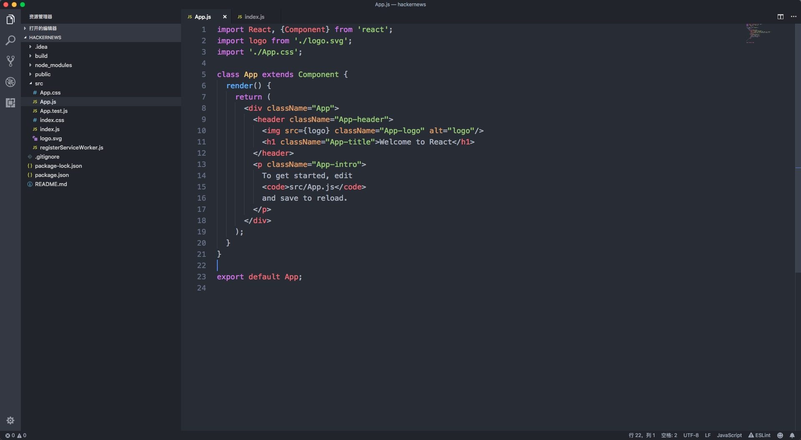

# Visual Studio Code使用小结

## 扯点淡
用了`webstorm`之后，再看`vscode`，发现微软出的这个工具确实牛逼。还tm免费，目前看不到比它更牛逼的ide了！优点不说了。

但是在mac上使用起来，总是有点不太方便，因为很多快捷键和系统默认的都冲突了。

诶，都是泪，今年618或双11，撸个`Filco`的机械键盘吧...

## 常用快捷键

#### 注释

* 单行注释: `cmd + /`

```
{ 
"key": "cmd+/",                 
"command": "editor.action.commentLine",
"when": "editorTextFocus && !editorReadonly" 
}
```

* 多行注释: `ctrl+shift+/`

```
{
    "key": "ctrl+shift+/",
    "command": "editor.action.blockComment",
    "when": "editorTextFocus && !editorReadonly"
}
```

#### 代码提示 `ctrl+/`

`ctrl+space` --> `ctrl+/`

```
{
    "key": "ctrl+/",
    "command": "editor.action.triggerSuggest",
    "when": "editorHasCompletionItemProvider && editorTextFocus && !editorReadonly"
}
```

#### f1~f12

`mac`系统`f1~f12`都是系统默认的快捷键，所以在`vs`中全部都用不了。

修改的时候注意一点，要实现修改必须使用`mac`键盘的`fn`键。
例如：
`ctrl+fn+f12`对应的是`ctrl+f12`

---

* `f12` --> `ctrl+f12` : 移动到定义处

```
{
    "key": "ctrl+f12",
    "command": "editor.action.goToDeclaration",
    "when": "editorHasDefinitionProvider && editorTextFocus && !isInEmbeddedEditor"
}
```

* `f11` --> `ctrl+f11` : 单步调试

```
{
    "key": "ctrl+f11",
    "command": "workbench.action.debug.stepInto",
    "when": "inDebugMode"
}
```

* `f10` --> `ctrl+f10` : 单步跳过

```
{
    "key": "ctrl+f10",
    "command": "workbench.action.debug.stepOver",
    "when": "inDebugMode"
}
```

* `ctrl+f5` : 非调试启动

#### 代码格式化 `alt+shift+f`

---

## 默认设置

* 修改字体，修改字体大小等设置

因为我外接了一个dell24寸的显示器,所以字体搞大了点😄.

```
{
    "editor.fontFamily": "Source Code Pro,Menlo, Monaco, 'Courier New', monospace",
    "editor.renderLineHighlight": "none",
    "editor.fontSize": 18,
    "editor.roundedSelection": false,
    "workbench.colorTheme": "Atom One Dark",
    "editor.tabSize": 2
}
```

* 主题选择的是：`Atom One Dark Theme`




## 开发插件


## 参考

[干货 | 教你打造一款颜值逆天的 VS Code](https://juejin.im/entry/587e0f2f570c352201113e14)


