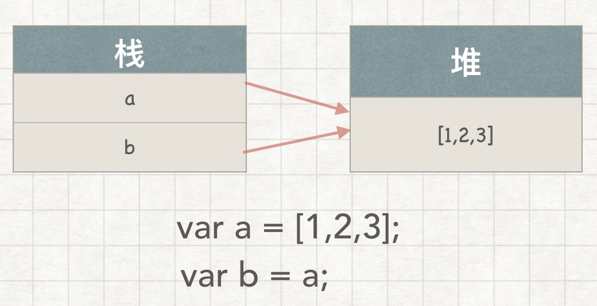
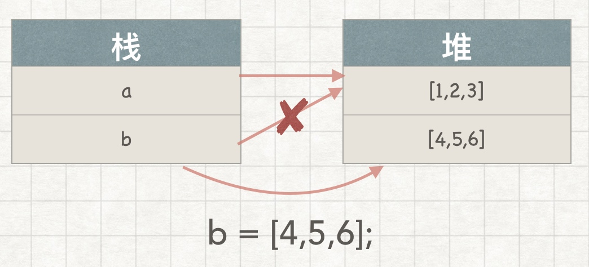

# 值和引用

## 扯点蛋
除看JS时，看到神作《JS高程3》时，记得里面说过一句，js全都是值专递，当时非常不能理解。

明明有引用啊，怎么就是值传递呢！

这个疑问🤔️一直在心里种了个草......

## 值传递

在许多编程语言中，赋值和参数传递可以通过值复制(value-copy)或者引用复制 (reference-copy)来完成。

JavaScript 中没有指针，引用的工作机制也不尽相同。在 JavaScript 中变量不可能成为指向另一个变量的引用。

> **JavaScript 引用指向的是值**。如果一个值有 10 个引用，这些引用指向的都是同一个值，它们相互之间没有引用 / 指向关系。

> JavaScript 对值和引用的赋值 / 传递在语法上没有区别，完全根据值的类型来决定。

> -你不知道的JavaScript

上面这两句话非常关键:

* JavaScript 引用指向的是值
* JavaScript 对值和引用的赋值 / 传递在语法上没有区别
* 完全根据值的类型(简单/引用?)来决定

>简单值(即标量基本类型值)总是通过值复制的方式来赋值 / 传递，包括 null、undefined、字符串、数字、布尔和 ES6 中的symbol。
>
>复合值—对象(包括数组和封装对象)和函数，则总是通过引用复制的方式来赋值 / 传递。

看到这里，就是最大的疑问产生了，不是都TM说了，对象和函数是通过引用复制的方式来传递/赋值的吗？

🤯🤯怎么就值传递了？

看下面的例子，来加深一下疑惑：

```js
var c = [1,2,3];
var d = c; // d是[1,2,3]的一个引用 
d.push( 4 );
c; // [1,2,3,4]
d; // [1,2,3,4]
```

c 和 d 分别指向同一个复合值 [1,2,3] 的两个不同引用。请注意，c 和 d 仅仅是指向值 [1,2,3]，并非持有。所以它们更改的是同一个值(如调用 .push(4))，随后它们都指向更改后的新值 [1,2,3,4]。

再来一个例子：

```js
var a = [1,2,3];
var b = a;
a; // [1,2,3]
b; // [1,2,3]
// 然后
b = [4,5,6]; 
a; // [1,2,3] 
b; // [4,5,6]
```

>由于引用指向的是值本身而非变量，所以一个引用无法更改另一个引用的指向。





b=[4,5,6] 并不影响 a 指向值 [1,2,3]，除非 b 不是指向数组的引用，而是指向 a 的指针， 但在 JavaScript 中不存在这种情况!

再看个参数传递的例子：

```js
function foo(x) {
    x.push(4);
    x; // [1,2,3,4]
    // 然后
    x = [4, 5, 6];
    x.push(7);
    x; // [4,5,6,7]
}
var a = [1, 2, 3];
foo(a);
a; // 是[1,2,3,4]，不是[4,5,6,7]
```

其实就相当于

```js
var a = [1,2,3];
let x = a;
x.push(4);
x = [4,5,6];
x.push(7);

a;  // [1,2,3,4]
```

我们不能通过引用 x 来更改引用 a 的指向，只能更改 a 和 x 共同指向的值。

再说一遍：
js中的引用指向的是值，不是变量！
js中的引用指向的是值，不是变量！
js中的引用指向的是值，不是变量！

请记住:我们无法自行决定使用值复制还是引用复制，一切由值的类型来决定。

---

如果通过值复制的方式来传递复合值(如数组)，就需要为其创建一个复本，这样传递的 就不再是原始值。

foo(a.);

slice(..) 不带参数会返回当前数组的一个浅复本(shallow copy)。由于传递给函数的是指
向该复本的引用，所以 foo(..) 中的操作不会影响 a 指向的数组。

---

相反，如果要将标量基本类型值传递到函数内并进行更改，就需要将该值封装到一个复合
值(对象、数组等)中，然后通过引用复制的方式传递。

```js
function foo(wrapper) {
    wrapper.a = 42;
}
var obj = {
    a: 2
};
foo(obj);
obj.a; // 42
```

这里 obj 是一个封装了标量基本类型值 a 的封装对象。obj 引用的一个复本作为参数 wrapper 被传递到 foo(..) 中。这样我们就可以通过 wrapper 来访问该对象并更改它的属 性。函数执行结束后 obj.a 将变成 42。

## 总结

简单标量基本类型值(字符串和数字等)通过值复制来赋值 / 传递，而复合值(对象等) 通过引用复制来赋值 / 传递。JavaScript 中的引用和其他语言中的引用 / 指针不同，它们不 能指向别的变量 / 引用，只能指向值。

ps:现在终于明白了为什么JS高程3说，js中都是值传递了！


