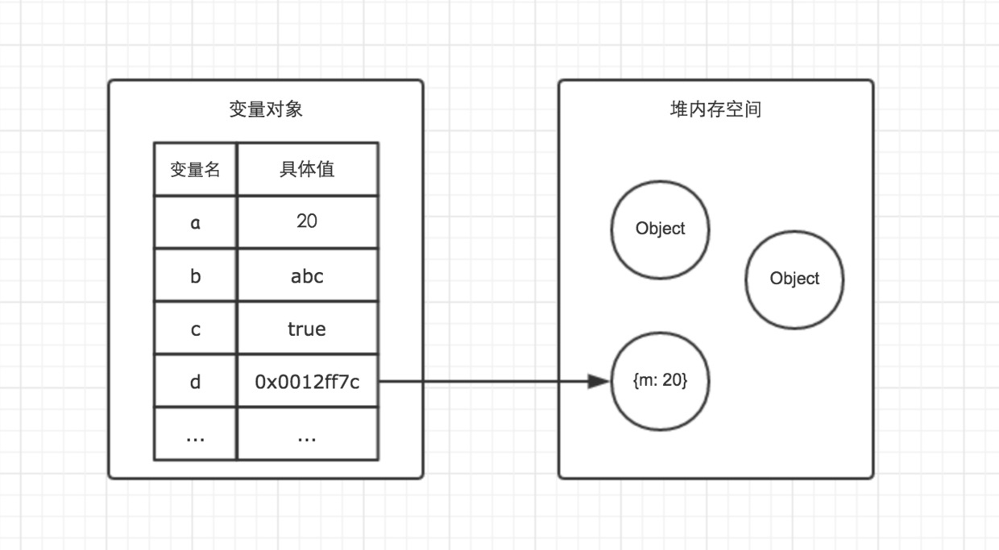
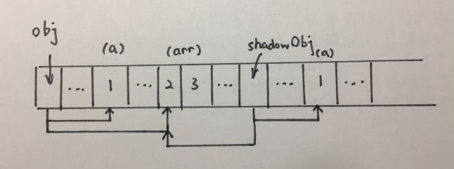
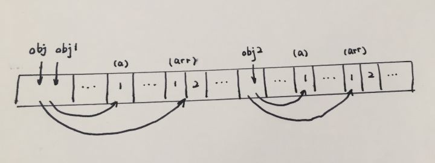

# 浅谈JS对象复制-深浅复制


## 说在前面

JS中对象复制分为两类：

* 浅复制
* 深复制

且这里还要重点分清楚**基本类型**和**复杂类型**（引用类型）：

* 基本数据类型：`String`,`Boolean`,`Number`,`Null`,`Nndefined`
* 复杂数据类型：`数组(Array)`,`对象(Object)`,`函数(Function)`...

首先先确定一个很重要的概念：深复制和浅复制只针对**引用类型**。
浅复制复制的对象属性中如果也是引用对象的话，那么复制的是引用的地址；并且只复制一层对象的属性，而深复制则递归复制了所有层级。

```js
// 简单类型都放在栈（图左）（stack）里
// 引用类型都放在堆（图右）（heap）里
var a = 20;
var b = 'abc';
var c = true;
var d = {m: 20} // 地址假设为0x0012ff7c
```




## 基本数据类型的复制

> 基本数据类型的复制都是对值本身的复制。

这里再重新提醒一下,`String`也是基本数据类型。很多时候会疏忽。
基本数据类型：`String`,`Boolean`,`Number`,`Null`,`Nndefined`。

> 基本数据类型都是**不可变的**.

以下以字符串为例：

```js
// 字符串
var orgstr = "zengyuxi";
var copystr = orgstr;
var newstr = orgstr.concat("!!!");

orgstr // "zengyuxi"
copystr // "zengyuxi"
newstr // zengyuxi!!!
```

以上可以看到`orgstr`进行了赋值之后，后续无论怎么操作，都不会改变了。

## 深复制/浅复制的区别

思考一下这个对象：

```js
function anotherFunction() {
  /*..*/
}
var anotherObject = {
  c: true
};
var anotherArray = [];
var myObject = {
  a: 2,
  b: anotherObject, // 引用，不是复本! 
  c: anotherArray, // 另一个引用!
  d: anotherFunction
};
```

> 如何准确的描述`myObject`的复制呢？

浅复制：
对于浅复制来说，复制出的新对象中，a的值会复制旧对象中a的值,也就是2.
但是新对象中的b,c,d三个属性其实只是三个引用,他们和旧对象中的b,c,d引用对象是一样的。

深复制：
对于深复制来说，除了复制`myObject`之外，还会复制`anotherObject`和`anotherArray`

## 浅复制的实现
使用`es6`的`Object.assign(..)`方法:

```js
var newObj = Object.assign({}, myObject);
newObj === myObject;    // false
newObj.a; // 2
newObj.b === anotherObject; // true
newObj.c === anotherArray; // true
newObj.d === anotherFunction; // true
```

可以清楚的看到：

* 生成的`newObj`是新对象，内存地址和`myObject`不一样.
* `newObj.b`,`newObj.c`,`newObj.d`和旧对象的引用地址是一致的。

浅复制的简单实现：

```js
var obj = { a:1, arr: [2,3] };
var shallowObj = shallowCopy(obj);

function shallowCopy(src) {
  var dst = {};
  for (var prop in src) {
    if (src.hasOwnProperty(prop)) {
      dst[prop] = src[prop];
    }
  }
  return dst;
}
```
因为浅复制只会将对象的各个属性进行依次复制，并不会进行递归复制，而 JavaScript 存储对象都是存地址的，所以浅复制会导致 obj.arr 和 shallowObj.arr 指向同一块内存地址,大概的示意图如下:




## 深复制
深复制，不仅将原对象的各个属性逐个复制出去，而且将原对象各个属性所包含的对象也依次采用深复制的方法**递归复制**到新对象上。

```js
var obj = { a:1, arr: [1,2] };
var obj2 = deepCopy(obj);
```

结果如下面的示意图所示：




* `JSON`实现
	最简单实现深复制的方式，采用`JSON`来实现。
	也就是说可以被序列化为一个 `JSON` 字符串并且可以根据这个字符串解析出一个结构和值完全一样的对象。
	
	```js
	var newObj = JSON.parse( JSON.stringify( someObj ) );
	```
	
	当然，这种方法需要保证对象是`JSON`安全的，所以只适用于部分情况。

* 递归实现
	
	```js
	// todo:...
	```

## 总结

* `String`其实是基本数据类型，且是不可变的，所以数据都是按值传递的
* 深复制和浅复制，针对的是引用数据类型
* 无论是深复制还是浅复制，都会生成一个新的对象
* 浅复制，只会复制一层属性，且属性是对象的话，其实是旧对象中的引用地址
* 深复制，会将原对象的各个属性逐个复制出去，且将原对象所包含的对象也采用深复制的方式递归复制到新对象上。

## 参考
* [javaScript中浅拷贝和深拷贝的实现](https://github.com/wengjq/Blog/issues/3)
* [javascript中的深拷贝和浅拷贝？](https://www.zhihu.com/question/23031215)

