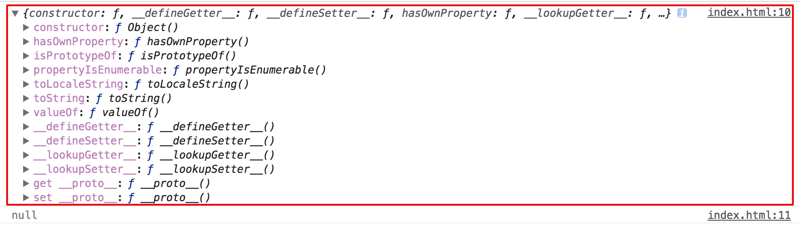
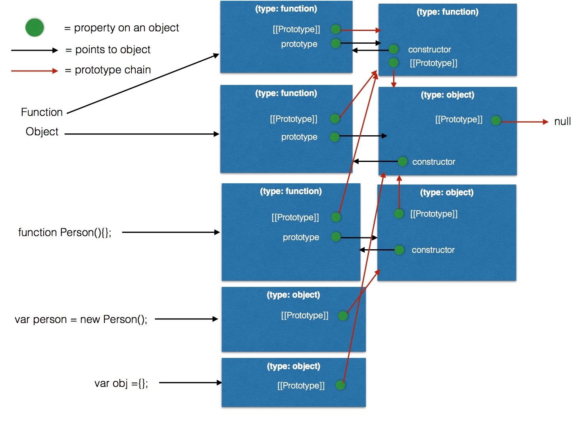

# 通过Object.create和new操作加深理解JS对象和原型链

## 扯点淡
学JS之前就听说过，前端坑很多，但到底怎么坑？心中还没有一个概念，等我看完《js高程3》后，我大致了解了：JS这门语言，远远没有想象的那么简单。相反他的核心原理和机制必须搞清楚，才能完成接下来JS进阶的学习！

到现在前前后后，断断续续学了JS一个月的时间，感觉连JS的毛都没摸到！呜呼～

开始正文... ...

## JS对象

首先搞清楚一点：申明对象的方式有两种,声明(文字)形式和构造形式!

* 声明(文字)形式:

```js
var myObj = {
    key: value
};
```

* 构造形式:

```js
var myObj = new Object();
myObj.key = value;
```

记住：
构造形式，这里出现了==new==关键字。

疑问1🤔️：

* 这里为什么会出现new关键字？
	* 之前学习到new关键字只对于function使用啊,那么Object是function了吗？
	* 已经确定的是`new`返回的是一个**对象**.

接着，对这两种创建方式做一个测试：

```js
var myObj = new Object();
console.log(myObj.__proto__ === Object.prototype);  // true

var myobj2 = {
};
console.log(myobj2.__proto__ === Object.prototype); // true
```

到这里我有理由相信: 文字声明形式其实就是语法糖，底层实现还是`new Object()；`那一套！

疑问2🤔️:

* `__proto__`和`prototype`是个啥J*意思,为什么会相等？
	* 已经确定的是`prototype`是创建`function`时生成的对象!
	* `__proto__`是啥？

带着这些问题，看下面的分析。

## 原型对象

#### `__proto__`( [[prototype]] )

引用《JavaScript权威指南》的一段描述：

> Every JavaScript object has a second JavaScript object (or null ,
but this is rare) associated with it. This second object is known as a prototype, and the first object inherits properties from the prototype.

翻译出来就是每个JS对象一定对应一个**原型对象**，并从原型对象继承属性和方法。好啦，**既然有这么一个原型对象，那么对象怎么和它对应的**？

误解：
之前一直以为原形对象就是创建`function`时生成的内置对象`prototype`。其实没这么简单！

来自<神作> 结论：
对象`__proto__`属性的值就是它所对应的原型对象!

```js
var myObj = new Object();
myObj.__proto__ === Object.prototype;  // true

var myobj2 = {
};
myobj2.__proto__ === Object.prototype; // true
```

疑问🤔️:
`Object.prototype` 又是什么东西？

#### prototype

上面提到过，只有函数`function`才有`prototype`属性。

为什么只有函数才有prototype属性？ES规范就这么定的。

开玩笑了，其实函数在JS中真的很特殊，是所谓的_一等公民_。JS不像其它面向对象的语言，它没有类（class，ES6引进了这个关键字，但更多是语法糖）的概念。JS通过函数来模拟类。

当你创建函数时，JS会为这个函数自动添加`prototype`属性，值是一个有 `constructor` 属性的对象。
而一旦你把这个函数当作构造函数（`constructor`）调用（即通过`new`关键字调用），那么JS就会帮你创建该构造函数的实例，实例继承构造函数`prototype`的所有属性和方法（实例通过设置自己的`__proto__`指向承构造函数的`prototype`来实现这种继承）。

话有点绕，没看懂，问题来了🤔️:

* `new` 操作搞了什么事？
* `new` 是如何把一个函数变成一个对象的?

看下面的分析......

## new

来自MSDN的描述：

>创建一个用户自定义的对象需要两步：

> * 通过编写函数来定义对象类型。
* 通过new来创建对象实例。

> 当代码 new Foo(...) 执行时，会发生以下事情：
> 
> 1. 一个继承自 Foo.prototype 的新对象被创建。
> 2. 使用指定的参数调用构造函数 Foo ，并将 this 绑定到新创建的对象。new Foo 等同于 new Foo()，也就是没有指定参数列表，Foo 不带任何参数调用的情况。
> 3. 由构造函数返回的对象就是 new 表达式的结果。如果构造函数没有显式返回一个对象，则使用步骤1创建的对象。（一般情况下，构造函数不返回值，但是用户可以选择主动返回对象，来覆盖正常的对象创建步骤）

说白点就是下面4个步骤：

使用 `new` 来调用函数，或者说发生构造函数调用时，会自动执行下面的操作。

1. 创建(或者说构造)一个全新的对象。
2. 这个新对象会被执行[[Prototype]]连接。
3. 这个新对象会绑定到函数调用的this。
4. 如果函数没有返回其他对象，那么new表达式中的函数调用会自动返回这个新对象。

`var o1 = new Foo();`的底层实现大概是这样的：

```js
// new的实现
var o1 = new Object();
o1.__proto__([[prototype]]) = Foo.prototype;
Foo.call(o1);
```

至此，对于开头的疑问，基本有了明确的解答
`var myObj = new Object();`，`Object`是构造函数,所以`myObj.__proto__ === Object.prototype`。
对于对象字面量，ES规范定义对象字面量的原型就是`Object.prototype`。

## Function & 原型链的顶端
ES5关于Object和Function的规定：

* [Object](http://www.ecma-international.org/ecma-262/5.1/#sec-15.2)

* [Function](http://www.ecma-international.org/ecma-262/5.1/#sec-15.3)

---

**原型链的尽头（root）是Object.prototype。** 
 
通过在Chrome中发现：所有对象均从`Object.prototype`继承属性.

```js
console.log(Object.prototype);
console.log(Object.prototype.__proto__);	//null
```



接着，
通过查看规范得出：

> The value of the [[Prototype]] internal property of the Object constructor is the standard built-in Function prototype object.

>The value of the [[Prototype]] internal property of the Object prototype object is null, the value of the [[Class]] internal property is "Object", and the initial value of the [[Extensible]] internal property is true.

`Object`本身是个（构造）函数，是`Function.prototype`的实例，即`Object.__proto__`就是`Function.prototype`.

```
Object.__proto__ === Function.prototype  //true
```

🤔️ `Function`是个啥？看规范！

> The Function prototype object is itself a Function object (its [[Class]] is "Function") that, when invoked, accepts any arguments and returns undefined.

>The value of the [[Prototype]] internal property of the Function prototype object is the standard built-in Object prototype object (15.2.4). The initial value of the [[Extensible]] internal property of the Function prototype object is true.

> The Function prototype object does not have a valueOf property of its own; however, it inherits the valueOf property from the Object prototype Object.

* `Function.prototype`像普通函数一样可以调用，但总是返回`undefined`。

* 普通函数实际上是`Function`的实例，即普通函数继承于`Function.prototype`。`func.__proto__ === Function.prototype`。

* `Function.prototype`继承于`Object.prototype`，并且没有`prototype`这个属性。`func.prototype`是普通对象，`Function.prototype.prototype`是null。

* 所以，`Function.prototype`其实是个另类的函数，可以独立于/先于`Function`产生.

所以最后得出结论：

结论1: **先有Object.prototype（原型链顶端），Function.prototype继承Object.prototype而产生，最后，Function和Object和其它构造函数继承Function.prototype而产生**

结论2: `__proto__`实际上并不存在于你使用的对象中(上述的myObj和myObj2)。
他和`.constructor`一样（(.toString()、.isPrototypeOf(..)，等等)）。存在于内置的`Object.prototype`中.

## 原型链 & [[Prototype]] 机制

在面向类的语言中，类可以被复制(或者说实例化)多次，就像用模具制作东西一样。
之所以会这样是因为实例化(或者继承)一个类就意味着“把类的 行为复制到物理对象中”，对于每一个新实例来说都会重复这个过程。

在 JavaScript 中，并没有类似的复制机制。
你不能创建一个类的多个实例，只能创建 多个对象，它们 `[[Prototype]]` 关联的是同一个对象。
但是在默认情况下并不会进行复制， 因此这些对象之间并不会完全失去联系，它们是互相关联的。

`new Foo()` 会生成一个新对象(我们称之为 a)，这个新对象的内部链接 `[[Prototype]]` 关联 的是 `Foo.prototype` 对象。

最后我们得到了两个对象，它们之间互相关联，就是这样。我们并没有初始化一个类，实 际上我们并没有从“类”中复制任何行为到一个对象中，只是让两个对象互相关联。

#### (原型)继承

```js
function Foo(name) {
    this.name = name;
}
Foo.prototype.myName = function () {
    return this.name;
};

function Bar(name, label) {
    Foo.call(this, name);		// (1)
    this.label = label;
}
// 我们创建了一个新的 Bar.prototype 对象并关联到 Foo.prototype 
Bar.prototype = Object.create( Foo.prototype );	//(2)
// 注意!现在没有 Bar.prototype.constructor 了 // 如果你需要这个属性的话可能需要手动修复一下它
Bar.prototype.myLabel = function () {
    return this.label;
};
var a = new Bar("a", "obj a");
a.myName(); // "a"
a.myLabel(); // "obj a"
```

实现（原型）继承的核心代码其实就两句：

* `Foo.call(this, name);`
* `Bar.prototype = Object.create( Foo.prototype );`

这里着重分析第二句代码`Bar.prototype = Object.create( Foo.prototype );`
这条语句的意思是:“创建一个新的 `Bar.prototype` 对象并把它关联到 `Foo.prototype`”。


🤔️🤔️🤔️为什么是`Object.create()`呢？
如果

* `Bar.prototype = Foo.prototype;`

或是

* `Bar.prototype = new Foo();`
会怎么样？

解：

* `Bar.prototype = Foo.prototype` 并不会创建一个关联到 `Bar.prototype` 的新对象，它只 是 让 `Bar.prototype` 直 接 引 用 `Foo.prototype` 对 象。 因 此 当 你 执 行 类 似 `Bar.prototype. myLabel = ...` 的赋值语句时会直接修改 `Foo.prototype` 对象本身。显然这不是你想要的结 果，否则你根本不需要 `Bar` 对象，直接使用 `Foo` 就可以了，这样代码也会更简单一些。

* `Bar.prototype = new Foo()` 的确会创建一个关联到 `Bar.prototype` 的新对象。但是它使用 了 `Foo(..) `的“构造函数调用”，如果函数 `Foo` 有一些副作用(比如写日志、修改状态、注册到其他对象、给 `this` 添加数据属性，等等)的话，就会影响到 `Bar() `的“后代”，后果不堪设想。

因此，要创建一个合适的关联对象，我们必须使用 `Object.create(..)` 或 es6提供的`Object.setPrototypeOf(..)`

🤔️🤔️🤔️那么问题又来了`Object.create(...)`是什么鬼？

看下面的内容......

## Object.create

大致实现如下：

```js
function createAndLinkObject(o) {
    var F = function(){};
    F.prototype = o;
    return new F();
}
```

使用了一个一次性函数（方法执行完之后，F销毁）`function` F,通过改写它的`.prototype`属性使其指向想要关联的对象，然后再使用 `new F()` 来构造一个新对象进行关联。

回顾一下上面说的**new**的实现:

`var o1 = new Foo();`的底层实现大概是这样的：

```js
// new的实现
var o1 = new Object();
o1.__proto__([[prototype]]) = Foo.prototype;
Foo.call(o1);
```

看到这里差不多结束了，但看到一篇奇葩文章
[你不知道的javascript之Object.create 和new区别](http://blog.csdn.net/blueblueskyhua/article/details/73135938)

以下是让文章作者困惑的一个例子：

```js
var Base = function () {
    this.a = 2
}
var o1 = new Base();
var o2 = Object.create(Base);

o1.a	// a
o2.a	// undefined
```

结合之前的结论：
`Bar.prototype = Object.create( Foo.prototype );`
“创建一个新的 `Bar.prototype` 对象并把它关联到 `Foo.prototype`”

所以上述的`o2.__proto__`关联的是`Base`,而不是`Base.prototype`.

其根本原因是

```js
console.log(o1.__proto__ === Base.prototype);	// true
console.log(o2.__proto__ === Base);	//true
```


## 总结

* `Object`其实是一个(构造)函数

* `Object.prototype`才是位于原形链顶端

* JS正是通过`__proto__`和`prototype`的合作实现了原型链，以及对象的继承。

* 构造函数，通过`prototype`来存储要共享的属性和方法，也可以设置`prototype`指向现存的对象来继承该对象。

* 对象的`__proto__`指向自己构造函数的`prototype`。`obj.__proto__.__proto__`...的原型链由此产生。

* 先有Object.prototype（原型链顶端），Function.prototype继承Object.prototype而产生，最后，Function和Object和其它构造函数继承Function.prototype而产生

* 原型继承创建一个合适的关联对象，必须使用`Object.create(...)`方法或es6的新方法。

* `Bar.prototype = Object.create( Foo.prototype );`
“创建一个新的 `Bar.prototype` 对象并把它关联到 `Foo.prototype`”

好好琢磨下面这个图：来自[Function.prototype is a function](https://stackoverflow.com/questions/32928810/function-prototype-is-a-function)




