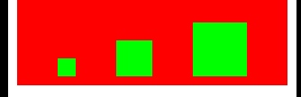

# Masonry等间距或等宽高排列View

## 核心api

```swift
/**
 *  distribute with fixed spacing
 *
 *  @param axisType     横排还是竖排
 *  @param fixedSpacing 两个控件间隔
 *  @param leadSpacing  第一个控件与边缘的间隔
 *  @param tailSpacing  最后一个控件与边缘的间隔
 */
- (void)mas_distributeViewsAlongAxis:(MASAxisType)axisType withFixedSpacing:(CGFloat)fixedSpacing leadSpacing:(CGFloat)leadSpacing tailSpacing:(CGFloat)tailSpacing;

/**
 *  distribute with fixed item size
 *
 *  @param axisType        横排还是竖排
 *  @param fixedItemLength 控件的宽或高
 *  @param leadSpacing     第一个控件与边缘的间隔
 *  @param tailSpacing     最后一个控件与边缘的间隔
 */
- (void)mas_distributeViewsAlongAxis:(MASAxisType)axisType withFixedItemLength:(CGFloat)fixedItemLength leadSpacing:(CGFloat)leadSpacing tailSpacing:(CGFloat)tailSpacing;
```

两个API，分为固定间隔不固定宽高，固定宽高不固定间隔，根据具体需求使用相应的即可。

**需要注意的是**： 横排的时候要相应设置控件数组的垂直约束，竖排的时候要相应设置控件数字的水平约束。

## 示例1: 等间距


```swift
//在红色View里面放三个正方形View, 等间距为10
NSInteger padding = 10;
UIView *yellowView1 = [[UIView alloc] init];
yellowView1.backgroundColor = [UIColor yellowColor];
[redView addSubview:yellowView1];

UIView *yellowView2 = [[UIView alloc] init];
yellowView2.backgroundColor = [UIColor yellowColor];
[redView addSubview:yellowView2];

UIView *yellowView3 = [[UIView alloc] init];
yellowView3.backgroundColor = [UIColor yellowColor];
[redView addSubview:yellowView3];

[@[yellowView1, yellowView2, yellowView3] mas_distributeViewsAlongAxis:MASAxisTypeHorizontal withFixedSpacing:padding leadSpacing:padding tailSpacing:padding];

[@[yellowView1, yellowView2, yellowView3] mas_makeConstraints:^(MASConstraintMaker *make) {
    make.top.equalTo(redView).offset(10);
    make.height.mas_equalTo(yellowView3.mas_width);
}];    
```

要注意的是, `mas_distributeViewsAlongAxis`这个方法仅仅完成了水平方向的布局, 如果想确定这几个View的位置, 还需要指定竖直方向位置和高度, 这里可以用数组直接调用 `mas_makeConstraints:^(MASConstraintMaker *make){}` 完成布局.

## 示例2: 控件大小相等


```swift
//在红色View里面放三个正方形蓝色View, 宽度均为30, 间隙一样大
NSMutableArray *blueViews = [NSMutableArray array];
for (NSInteger i = 0; i < 3; i++) {
    UIView *blueView = [[UIView alloc] init];
    blueView.backgroundColor = [UIColor blueColor];
    [redView addSubview:blueView];
    [blueViews addObject:blueView];
}
CGFloat padding2 = (300 - 3 * 30) / 4;
[blueViews mas_distributeViewsAlongAxis:MASAxisTypeHorizontal withFixedItemLength:30 leadSpacing:padding2 tailSpacing:padding2];
[blueViews mas_makeConstraints:^(MASConstraintMaker *make) {
    make.centerY.equalTo(redView);
    UIView *blueView = (UIView *)blueViews[0];
    make.height.mas_equalTo(blueView.mas_width);
}];
```
区别就是这里除了布局方向, 第一个和最后一个View的边距, 这里需要指定的是每个item的长度, 自动计算间隙, 所以这个要实现等间距, 其实是要通过item的数量, 以及父视图的宽度先计算出间距, 然后赋值给, leadSpacing和tailSpacing, 比如CGFloat padding2 = (300 - 3 * 30) / 4; 这里的300就是父视图的宽度, 30是指定的每个item的宽度, 这样计算好就可以保证, leadSpacing, tailSpacing, 和item之间的间距相同, 实现布局.

同样这个方法完成了水平方向的布局, 还需要完成竖直方向的布局.

## 示例3：控件大小不一样，等间距



```swift
//在红色View里面放三个大小不一样的绿色正方形, 间隙等大, masonry并没提供相关方法
NSMutableArray *greenViews = [NSMutableArray array];
for (NSInteger i = 0; i < 3; i++) {
    UIView *greenView = [[UIView alloc] init];
    greenView.backgroundColor = [UIColor greenColor];
    [redView addSubview:greenView];
    [greenViews addObject:greenView];
    [greenView mas_makeConstraints:^(MASConstraintMaker *make) {
        make.bottom.equalTo(redView).offset(-10);
        make.width.mas_equalTo(i*20 + 20);
        make.height.mas_equalTo(greenView.mas_width);
    }];
}
[redView distributeSpacingHorizontallyWith:greenViews];
```

首先在for循环内 , 完成了底部位置, 宽, 高的布局, 还缺少水平方向的位置, 即还要确定每个view的X, 这里用到了一个UIView的分类
- (void) distributeSpacingHorizontallyWith:(NSArray*)views;
这个分类直接用的里脊串的一篇文章中的代码, 就不贴出代码了, 简单说一下原理, 如图所示:


实现原理就是在View中创建greenViews.count + 1个占位的View(蓝色), 之后通过布局, 使占位View与要布局的View依次排开, 左右间距为0, 同时要约束所有的占位View宽度相等, 这样看来, 这些占位View的宽度, 就是greenViews的间距, 也就可以实现等间距布局了.


